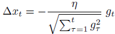
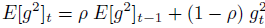
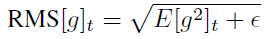
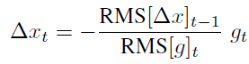
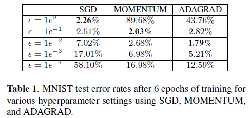
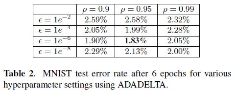
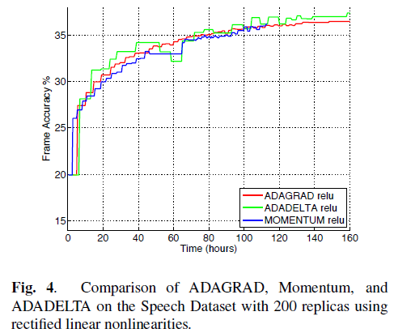

TODO: Summarize the paper:

* What is the core idea?
- Adaptively change the learning rate in a way that it reduces oscillations i.e. slows down close to minimas, and is large otherwise.
- Change step size based on the windowed accumulated gradient and also accumulated step sizes, which only require 1st order computations.
- Also scale the step size by the accumulated previous step sizes, giving it the correct units as if it were a 2nd order adaptive method

* How is it realized (technically)?
- Scaling gradient helps ensure we take an equal step in all directions
- Builds on ADAGRAD which scales the learning rate based on the accumulated sum of previous gradients. 

- By choosing an exponential decaying average for accumulating the gradient they solved the 0 step size problem of ADAGRAD

where epsilon is used to condition the denominator for numerical purposes.
- By assuming locally smooth curvature, they scaled up the step size using the exponentially decaying average of previous step sizes.

* How well does the paper perform?
- numerator RMS term lags behind the denominator by 1 time step, making it robust to large sudden gradients. Denominator increases slowing down the progress before numerator can blow up.
- The method makes approximations on Hessian and local curvature, giving it second order characteristics while still costing only one gradient computation per iteration.
- Training method is used on DNNs with sigmoid and ReLU units. The DNNs were trained for MNIST classification and speech recognition.

 

- ADADELTA is less sensitive to hyperparameter settings compared to other methods and converges quickly. 
- The lower layer gradients are larger than top layer gradients indicating that ADADELTA doesn't suffer from diminishing gradient problem (also tackles vanishing gradient in tanh network).
- Step size converges to a constant at the end of training resulting in parameter updates converging to zero (gradients become too small). Acts as if annealing schedule is present.
- For Audio signal classification, ADADELTA converged faster than other methods even under circumstances where accumulated gradients had significant noise.

## TL;DR
* New adaptive learning rate algorithm (ADADELTA) is introduced and it has first order computational cost
* ADADELTA is more robust to choice of hyperparameters used and converges smoothly and faster than other learning rates
* ADADELTA doesn't suffer from diminishing gradient problem for cases tested in the paper and exhibits characteristics of second order learning rates
