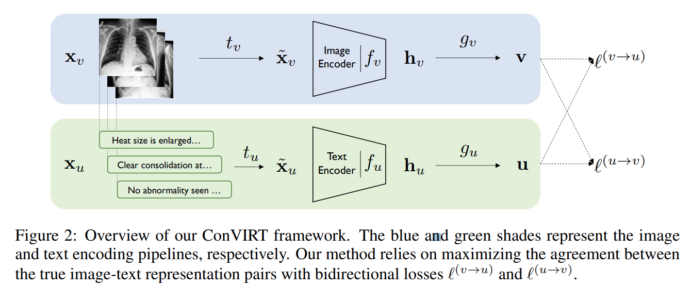
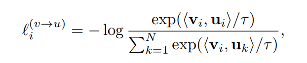
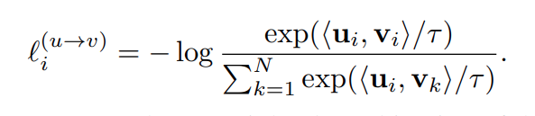
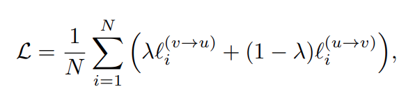
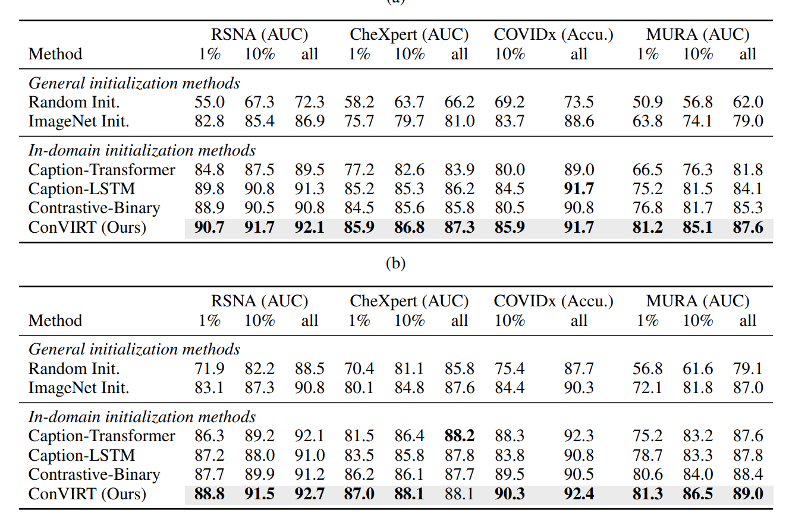
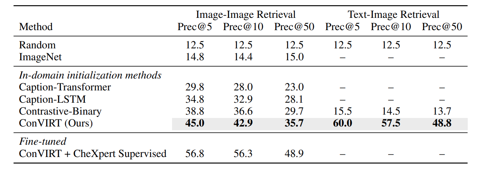
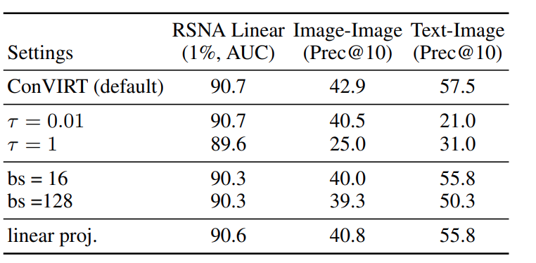

TODO: Summarize the paper:

* What is the core idea?

This paper presented ConVIRT, an unsupervisied way to learn visual representation of medical image with no expert input required besides a text labeling the image. It essentially train a backbone that can be transfered to different backbones.

* How is it realized (technically)?

The paper assumes that the inputs are given in $$x_v, x_u$$, a pair of image and text input. The goal is to learn an encoder that maps the image to a latent space reprsentation. They proposed the following:

- use a stochastic image transformation to transform $$x_v$$, $$x_u$$ to $$\tilde{x_v}$$, $$\tilde{x_u}$$
- use an autoencoder $$f_v$$, $$f_u$$ to transform $$\tilde{x_v}$$, $$\tilde{x_u}$$ to latent space $$h_v$$, $$h_u$$. In the paper, they used resnet50 for image encoder and BERT for text encoder.
- use a projection function $$g_v$$, $$g_u$$ to project $$h_v$$, $$h_u$$ to same dimensions space for constractive learning. They used two layer MLP for this task

They then use two different losses

**image to text contrastive loss**

where $$<v, u>$$ represents the cosine similarity and $$\tau$$ represents the temperature.

**text to image contrastive loss**

**Final loss**

Linear combination of the different weights

* How well does the paper perform?

In both image and text retrival, the paper beat all previous benchmark. However, all other benchmarks were modified at best from state of art method, which may suffer from inductive bias.

* What interesting variants are explored?

The author also released some analysis on hyperparameter, which is interesting to see. 

## TL;DR
* Contrastive learning with joint vision and text modility can bring state of art result
* Text information can bring additional critical knowledge to visual representations
* Even on different domains, utilizing pretrained model can make a difference.
