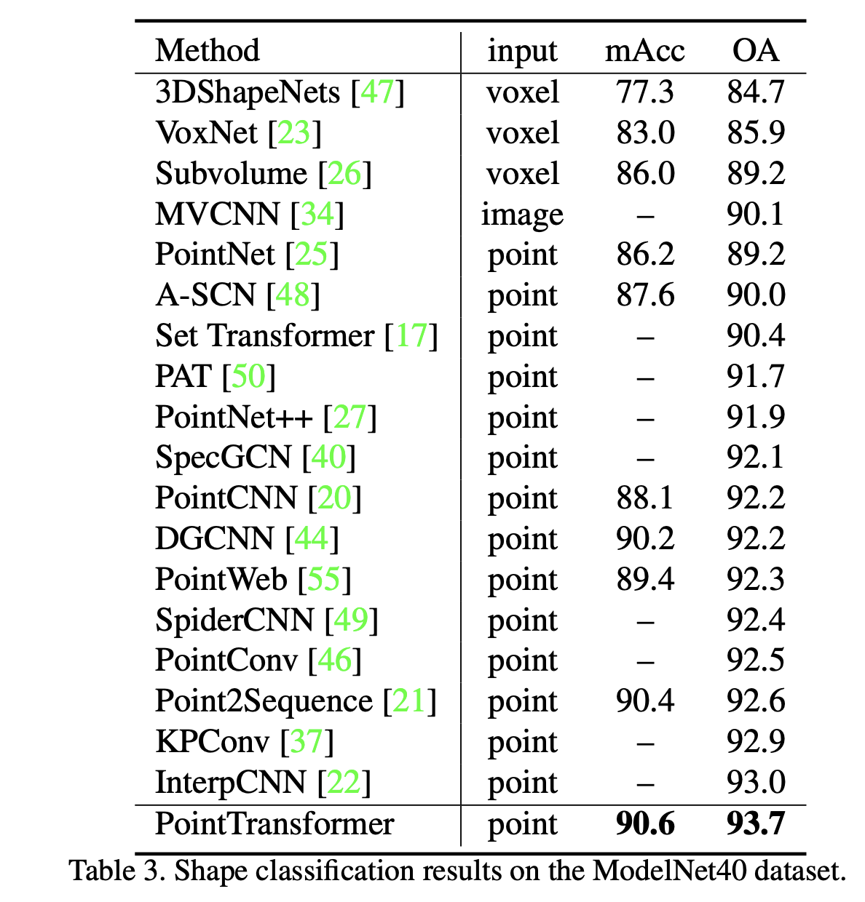

# What is the core idea?
- Self-attention is fundamentally a set operator (permutation-invariant) and thus a natural fit for modeling 3D point clouds, which are sets of 3D points
- The authors investigate how to apply self-attention/transformers to 3D point cloud processing
- "Point Transformer" networks outperform a variety of models in large- and small-scale 3D image understanding tasks

# How is it realized (technically)?
## Point Transformer Layer
- Point transformer layer uses vector self-attention (rather than scalar dot-product attention) with learnable position encoding function
- Attention is computed per point over its k nearest neighbors

### Position Encoding Function
- The position encoding is the difference of two 3D point coordinates (anchor point and neighboring point), passed into a 2-layer MLP with ReLU which is learned end-to-end
- This value is added to both the attention vector and transformed feature vector

## Point Transformer Block
- Comprised of: linear projections, point transformer layer, and a residual connection
- Input **x** is a set of feature vectors with associated coordinates **p**

## Point Transformer Network
- Point transformer blocks are combined with downsampling and interpolation modules which reduce and increase the cardinality of the point set as needed

## Training details
- SGD optimizer, momentum=0.9, weight decay=0.0001.
- For semantic segmentation: 40K iterations with initial LR=0.5, dropped by 10x at steps 24K and 32K.
- For shape classification/object part segmentation: 200 epochs, initial LR=0.05, dropped by 10x at epochs 120 and 160.

# How well does the paper perform?
Point Transformers achieve new state-of-the-art on semantic segmentation, shape classification, and object part segmentation, outperforming a variety of models including pointwise MLPs, voxel-based models, graph-based models, sparse convolutional networks, and continuous convolutional networks.

## Semantic Segmentation
- Task/Dataset: S3DIS -- 271 rooms, each point has a semantic label (floor, chair, etc.). The task is to label each point.
- Eval metrics: mean classwise accuracy (mAcc), overall pointwise accuracy (OA), and mean classwise Intersection over Union (IoU) (IoU computes the ratio of (1) the intersection of the predicted and true points for a class and (2) their union)

## Shape Classification
- Task/Dataset: ModelNet40; classify 12,311 CAD models into 40 object categories
- Eval metrics: mean classwise accuracy (mAcc) and overall accuracy over all classes (OA)

## Object Part Segmentation
- Task/Dataset: ShapeNetPart; 16k models of 16 shape types, each annotated with 2-6 parts, 50 part types total. Classify each point with a part.
- Eval metrics: IoU averaged over part category (cat. mIoU) and IoU averaged per instance over parts (inst. mIou)

# What interesting variants are explored?
Takeaways from ablation study:
- Vector attention significantly outperforms scalar dot-product attention
- k=16 neighbors works better than smaller or larger values
- Relative position encoding works better than absolute, and adding the encoding to both the attention vector and feature vectors works better than either alone
- Using softmax regularization in the attention computation is essential

# TL;DR
* Point transformer layers apply vector attention to local KNN neighborhoods of a point in a 3D point cloud; this operation is the basis of Point Transformer networks
* The authors experiment with different values of k, types of attention, and types of position encoding functions
* Point Transformer Networks achieve new SoTA on semantic segmentation, shape classification, and object-part segmentation
