* Core idea?

They design a Point Transformer network suitable for point cloud labeling and segmentation. They state that slef-attention function is a set operator that is invariant to permuation and cardinality of the inputs making it suitable for 3D point cloud processing. They introduce vector self-attention and trainable position encoding among others to make their residual transformer network invariant to permutation and cardinality. 

* Technical Implementation?

Given a set of feature vectors {x_i}, the vector self-attention function can be written as below:

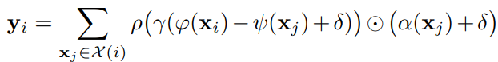

where alpah(x) is the transformed features and gamma is the attention vector. They apply self attention locally with a neighbourhood of each datapoint in the cloud. The point transformer layer is created as follows:

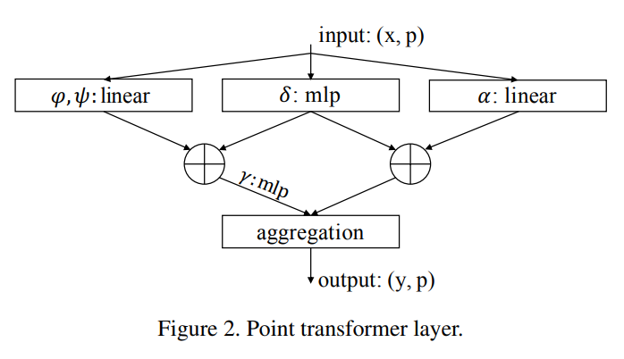

They define their position encoding based on the point coordinates multiplied with trainable parameters. This trainable encoding is added to both the attention and feature transformation as below:

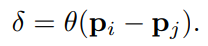

The vector theta is an MLP which optimizes the encoding parameters. 

To reduce the cardinality of the point set, they introduce transition stages. At each transition stage they do a farthest point sampling to identify the subset of the desired cardinality. To do dense predicitions they introduce
a transition up step which maps the lower set to the higher order set using trilinear interpolation. The transition functions are illustrated below:

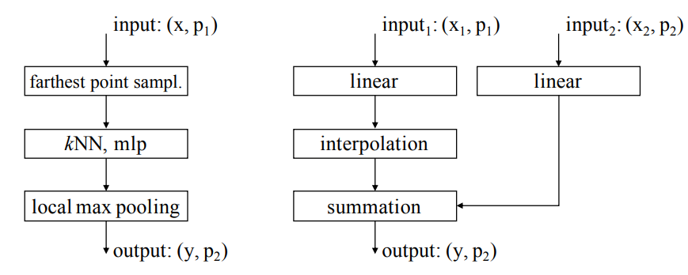

Finally they use a residual point transformer block which has a point transformer layer as shown below:

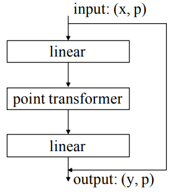

Overall the network structure is as below:

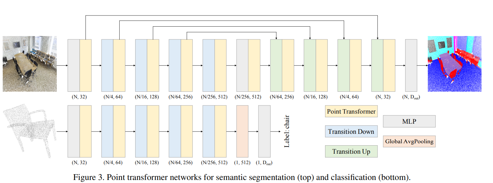

The model was trained using SGD with momentum and weight decay.

* Model Performance

They test their model on 3D semantic segmentation and shape classification tasks. 

For Segmentation tasks, the Point Transformer outperformed all prior models such as PointNet in all metrics. It even performed better than voxel based architectures such as SegCloud.

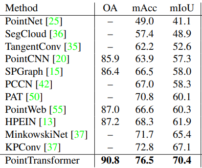

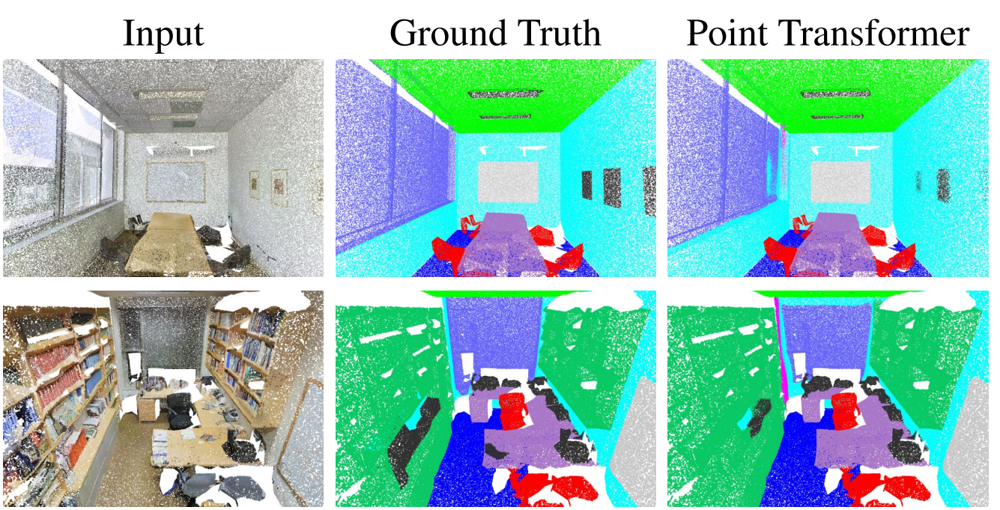

For shape classification, the PointTransformer outperformed all prior classifiers and achieved SOTA results as shown below:

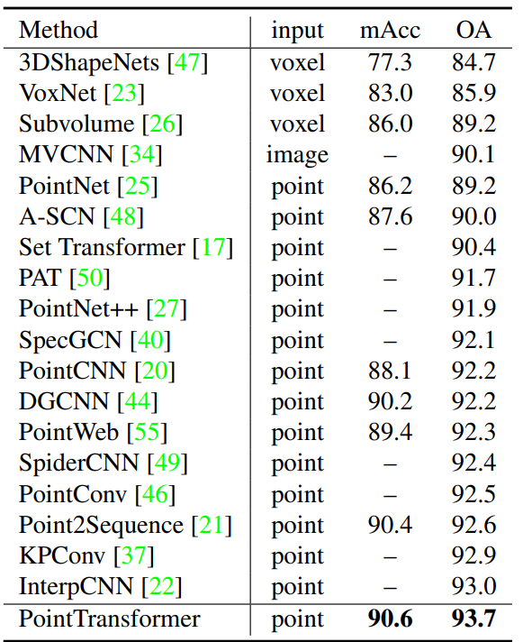

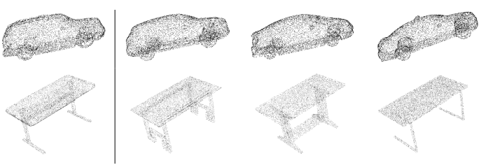

* Variants

The authors tried using relative and absolute position encodings and found relative positions to work the best.

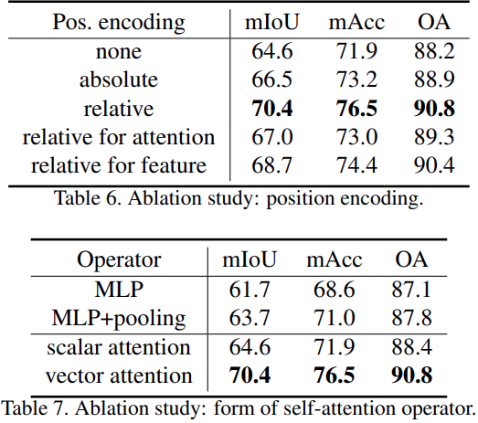

They tried using scalar attention instead of vector attention and found that vector attention outperformed by more than 6% absolute.

## TL;DR
* Authors create a transformer for 3D point cloud processing
* The transformer applies multiple techniques to make it invariant and reduce cardinality of the point cloud set making it easier to learn with transfomers
* The Point Transformer model outperformed all prior 3D point cloud models and achieved SOTA results
