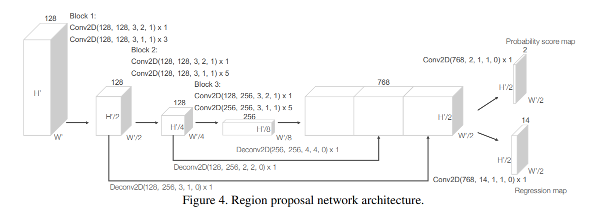
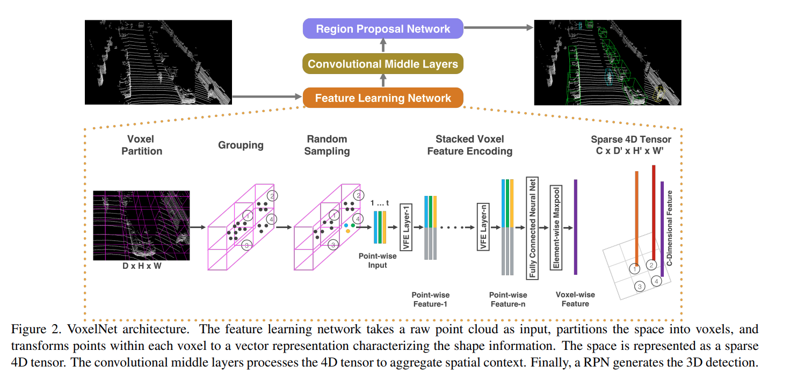
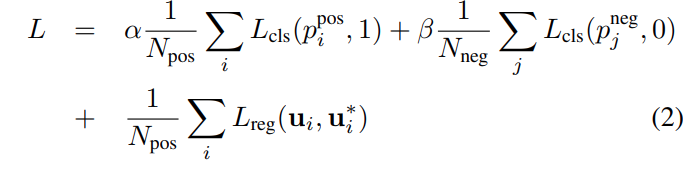
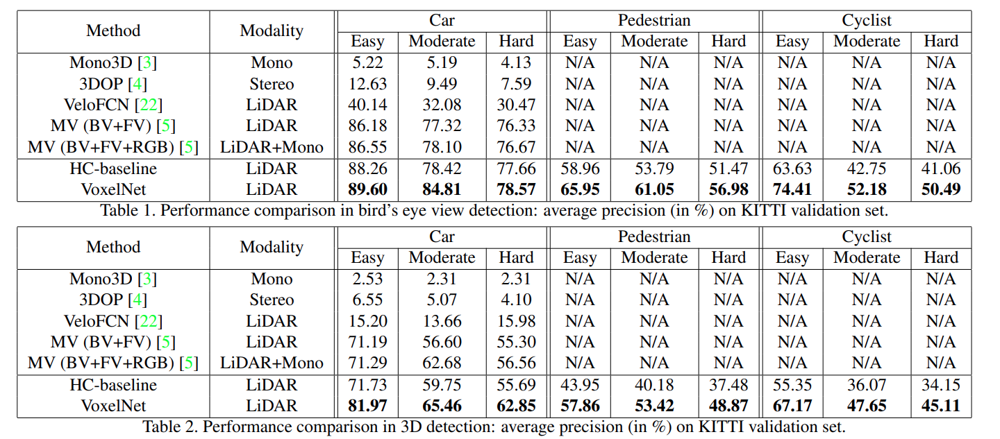
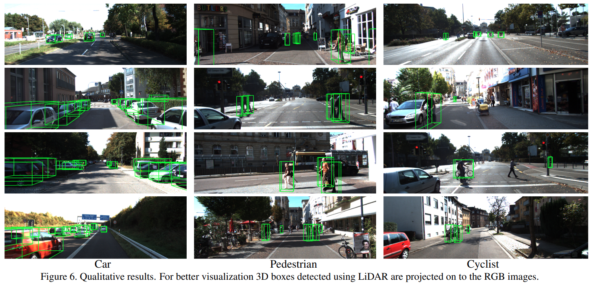
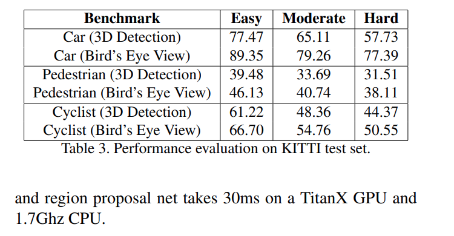

TODO: Summarize the paper:
* What is the core idea?

The paper introduced VoxelNet, an end to end deep network that goes from raw 3d point cloud (from lidar) to object detection. It eliminates the need of traditionally hand craft features from the raw representation

* How is it realized (technically)?

**Voxel Partitioning** From a raw 3d point cloud input, VoxelNet first partitions the points to voxels.

**Grouping** Points are grouped according to the voxels. Some voxels may contain significantly more points than others

**Random Sampling** Randomly Sample at most T points for voxels that have more than T points. This have drastic effect on computation speed and decrease imbalance of points

**Stacked Voxel Feature Encoding** A novel way of encoding the points in raw input (per voxel) to feature space. It feeds **points, reflectance, and mean of points** to encode the **surface shape**, as stacked encoder layer aggragrates information from surronding points.

**Sparse Tensor Representation**  Due to majority (90%) of the voxels beeing empty, we can represent the entire voxels as a sparse 4D tesnor of size CxD'xH'xW'

**Region Proposal Network** The algorithm then feed the feature map to the RPN, which is modified from the origional network

**Loss Function** Loss on 3d ground truth box by distinguishing positive anchors (Intersection over union with ground truth is above 0.6) from negative anchors (IoU is below 0.45)

* How well does the paper perform?

Overall, voxelnet performed much better than the baseline and previous works on all of Car, Pedestrian, and Cyclist detection

Visually, most of the bounding box matches the expectation

## TL;DR
* Voxelnet provides a unified approach to 3d bounding box classification
* A broadphase - narrow phase approach may provide significant speed up to the estimation
* With an efficient implementation, we can achieve high speed with great accuracy. 