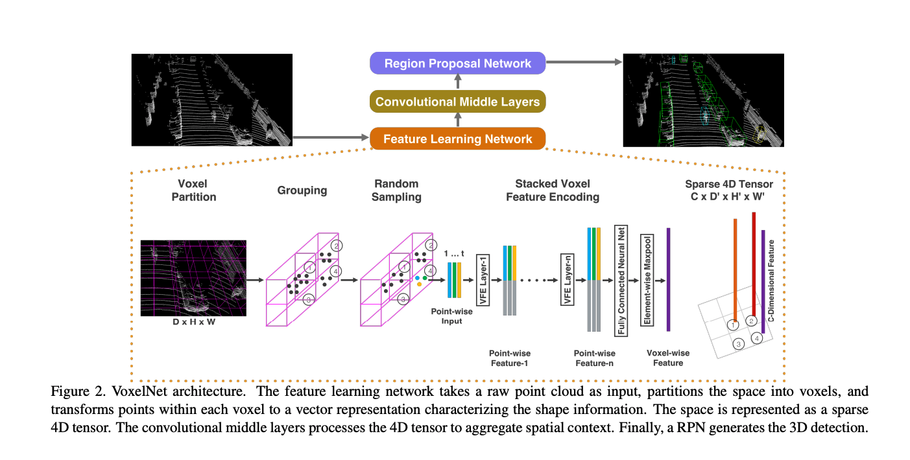
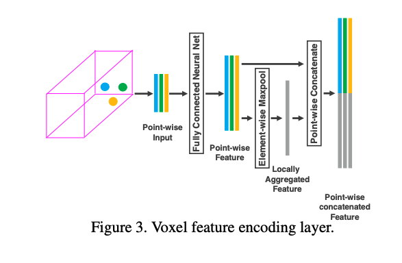
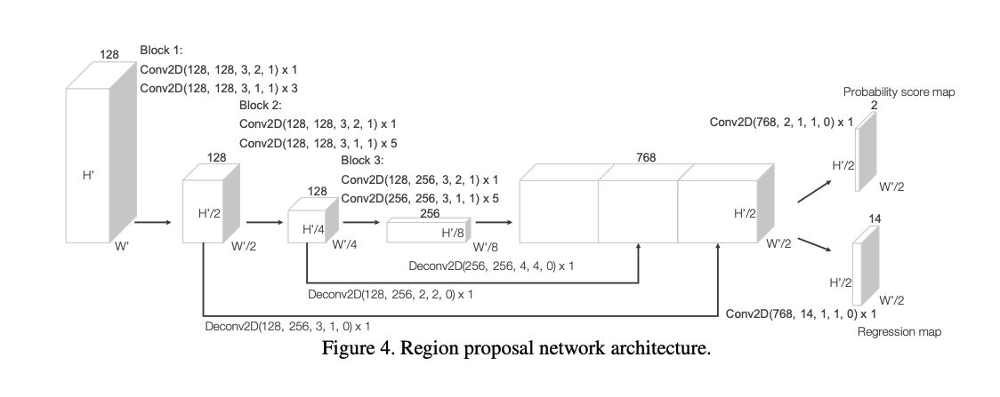
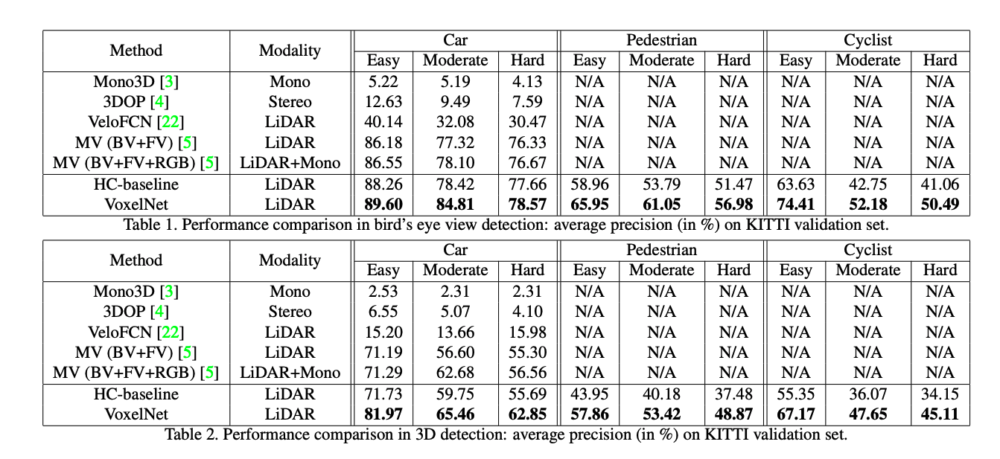

### Introduction

VoxelNet is a generic 3D detection framework that simultaneously learns a discriminative feature representation from point clouds and predicts accurate 3D bounding boxes, in an end-to-end fashion.

This work combines some neural networks designed for sparse point cloud data which is collected by LIDAR sensor. The framework reduces the usage of hand-crafted features. It got superior performance than MV3D with using only raw point cloud data.

### VoxelNetArchitecture
VoxelNet consists of three functional blocks:

1. **Feature Learning Network:** Calculate the features (4D sparse tensor) by feature learning network with raw point cloud data.

The authors use fully connected layer to project original raw 3D point to more high dimensions space, and use element-wise max pooling to get local aggregated features. In this part, they propose to combine aggregated features with high dimension features with a Voxel Feature Encoding Layer. By this way, we can get more descriptive voxel features.

2. **Convolutional middle layers:** Use 3D convolution to calculate high-level features.

This layer converts voxel features to dense 4D feature maps,and reduce the feature map size to one of four of original one by using three Convolution+BN+ReLU blocks.

3. **Region proposal Network:** Use Region Proposal Network to do classification and bounding box regression.

The RPN proposed by this paper use a technique of multi-scale feature aggregation to fuse high level and low level feature. The design of objective function and regression target is the same as Fast RCNN.

### Experiment

## TL;DR
* Three
* Bullets
* To highlight the core concepts
