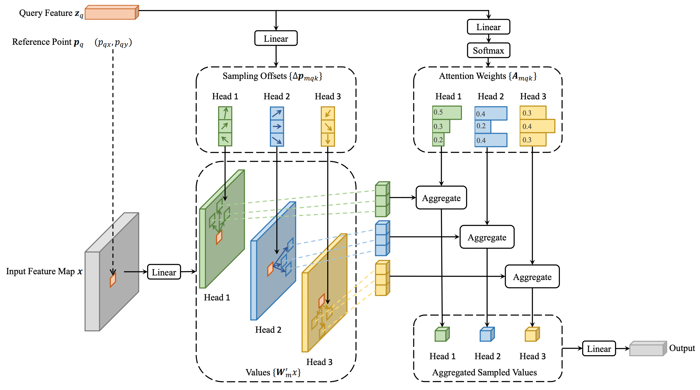

## What is the core idea?

The author propose Deformable DETR, an improved version of the object detection architecture called DEtection TRansformer (DETR) [1].
The main component proposed by the authors is the **deformable attention module**, which was inspired by deformable convolutions [2].
Specifically, the new attention module reduces the computational cost of regular attention by only attending to a small set of locations around a reference point (more details below).
This has two advantages.
First, the network trains faster -- **10x fewer epochs** compared to DETR.
Second, the network achieves better overall AP ("Average Precision") score than DETR and is particularly better at **detecting small objects**.

## How is the idea realized?

### Background

To understand Deformable DETR, we must first understand DETR.
DETR uses a standard ResNet backbone to extra the feature map for the input.
Then the feature map goes through a Transformer encoder/decoder, whose output is then fed into another feed-forward network to predict normalized box center coordinates.
These predicted bounding boxes are used to perform a bipartite graph matching to the ground truth object set, turning object detection into a set prediction problem.
DETR was successful as it removed the need for heuristic hand-crafted features that were necessary for earlier object deteciton techniques.
**Figure 2** below visualizes the mechanism behind DETR.

 
<b>Figure 2: The original DETR performs object detection by optimizing a Transformer-based set prediction network.</b>

 

### Problem with DETR

As DETR uses the standard Transformer, it also comes with all the same issues of a Transformer, such as high memory and computational cost.
This is particularly problematic when there are many small objects, which necessitates attending over many spatial locations at high resolution.
Due to the computational complexity of Transformer, this is not feasible and ultimately leads to low performance in such scenarios.

### Deformable DETR

To avoid this issue, Deformable DETR only attends to a **small set of sampling points around each reference point**.
Regardless of the spatial size of the feature map, Deformable DETR assigns a **fixed number of keys** for each query.
This is best explained by comparing the expressions for self-attention from DETR and Deformable DETR.

 

 

In the expressions above, $$\text{MultiHeadAttn}$$ refers to the standard attention used by DETR with $$m$$ heads.
For deformable attention ($$\text{DeformAttn}$$), the full key-query attention (the sum over $$\Omega_k$$) is replaced by a fixed-size attention over $$K$$ sampling points.
Since $$K$$ is a fixed constant, the computational cost of this attention layer no longer depends on the size of $$\Omega_k$$.

The $$K$$ sampling points are generated as offsets ($$\Delta p_{mqk}$$) from the reference point $$p_q$$.
Both the attention weights and offsets ($$A_{mqk}$$ and $$\Delta p_{mqk}$$) are obtained as linear projections of the query feature $$z_q$$.
**Figure 3** shows the overall architecture of deformable attention.

 
<b>Figure 3: Architectural diagram of Deformable DETR.  It significantly reduces the computational complexity of DETR by restricting attention to a few key sample points around the reference point.</b>

 

## How well does it perform?

This paper has a relatively concise experiment section, but nonetheless with important results.
The dataset used is COCO 2017, a standard benchmark for object detection.
For the ResNet feature extractor backbone, a ResNet-50 model pre-trained on ImageNet was used.

 
<b>Table 1: Main convergence and object detection performance comparisons to DETR variants.</b>

 

As shown in **Table 1**, Deformable DETR outperformed all variants of DETR the authors considered, as well as Fast R-CNN.
Notably, the number of epochs required to reach a comparable or higher AP (Average Precision) was **10x fewer** than regular DETR,
with similar parameter count.

## What other variants are explored?

The author provide additional miscellaneous improvements to Deformable DETR:
* Multi-scale version of deformable attention, as multi-scale architectures are known to improve performance across many vision tasks.
* **Iterative bounding box refinement**: Inspired by a similar technique from optical flow estimation, the authors make each layer **refine** the bounding boxes conditioned on the previous layer's output.
* **Two-step Deformable DETR**: In the experiments, authors use a variant where two Deformable DETR models are used in sequence, where the first model's region proposal are fed into the second model as object queries.

These improvements lead to a substantial improvement in AP, as shown at the bottom of **Table 1**.

## TL;DR
* Deformable DETR proposes **multi-scale deformable attention** modules, which reduce the computational complexity by restricting query to attend over a fixed number of points.
* Compared to DETR, Deformable DETR trains **10x faster** while maintaining a comparable performance.
* Using a large ResNet backbone, Deformable DETR is able to achieve **state-of-the-art object detection performance**.

## References

[1] Nicolas Carion, Francisco Massa, Gabriel Synnaeve, Nicolas Usunier, Alexander Kirillov, and Sergey Zagoruyko. End-to-end object detection with transformers. In ECCV, 2020. \\
[2] Jifeng Dai, Haozhi Qi, Yuwen Xiong, Yi Li, Guodong Zhang, Han Hu, and Yichen Wei. Deformable convolutional networks. In ICCV, 2017.

