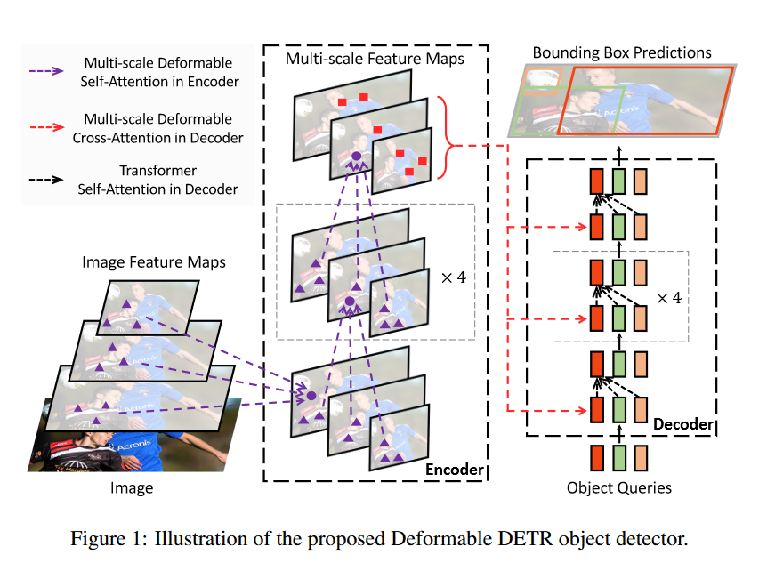
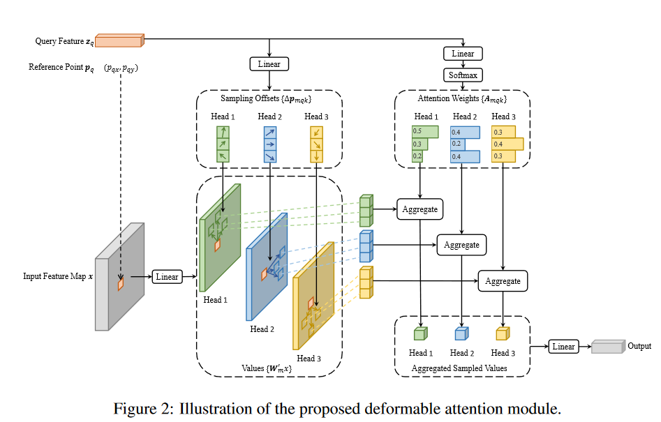
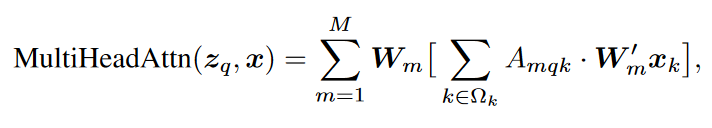
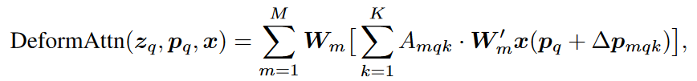
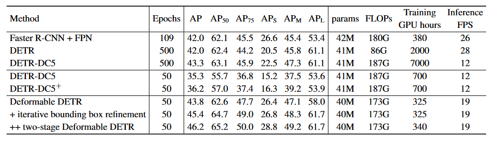

## Core Idea
Extends DETR by focusing the attention modules onto a small set of sampled points by using the ideas proposed in the deformable convolution paper. 
This allows for better results in significantly fewer training epochs and addresses the issues DETR has when attempting to detect small objects. 

## Technical Implementation
Below we see the a representation of the Deformable DETR model.

Convolutional feature maps are extracted from an image using a convolutional neural network (the authors used ResNet-50) before being fed into the encoder section of the network.
Information from the encoder along with object queries are then fed into the decoder to produce bounding boxes.

Revisitng issues with DETR:
- Requires significantly more training epochs than other object detectors
  - **Why?**  Right after initalization the cross attention modules look at all features and slowly learn which features are most important ultimately leading to sparse attention map.
  - Adding the deformable attention acts as a catalyst to identifying the sparse attention map and as a result the network is able to more directly and quickly learn which features to focus in on.
- Struggles with small objects
  - **Why?** In other object detectors higher resolution feature maps are used. Due to the nature of self attention the size of the feature map is realted quadratically to the self attention complexity which forces lower resolution feature maps to be used to achieve reasonable complexity.
  - In the Deformable DETR the deformable self attention allows for attention to focus on key elements ultimately boosting the performance on smaller objects.

Seen below is the deformable attention module introduced in this paper. 

It is very similar to a normal attention module with the addition of the learned Sampling Offsets block seen above. 

We can also see from the equations below that the deformable attention is only a slight modification of the general multi head attention. 

**Encoder:** 
Uses the same general structure as the encoder in DETR. 
Made up of only deformable self-attention modules.
Takes feature maps (from the convolutional network) as inputs and returns features maps of the same size as outputs.

**Decoder:**
Also uses the same general structure as the encoder in DETR. 
Takes in object queries and references the feature maps computed in the encoder.
Made up of both self- and cross-attention modules.
The cross attention modules interact with the features extracted in the encoder. 
Because we already use deformable attention in the encoder we do not use it in the cross attention modules.
The self attention modules interact on object queires, here the deformable attention modules are used. 

## Results
All experiements were conducted on the COCO 2017 dataset. 

A ResNet-50 model that was pretrained on ImageNet was used to extract the convolutional feature maps fed into the encoder. 

The parameters of the Deformable DETR followed the reccomendations of those presented in the DETR paper. 
One main difference was that Focal Loss was changed to 2 due to an increase in the number of object queried. 
The authors trained a vanilla DETR-DC5 with parameters matching those in their Deformable DETR model an report the results seen below as DETR-DC5+. 
 

As we can see above the Deformable DETR converges much quicker than the original DETR and is able to out perform DETR models that train for over 20x as many epochs. 

## Two-Stage Deformable DETR
In the original DETR and Deformable DETR the object quieres given to the decoder are independent of the image being looked at. 
The authors explored using a variant of Deformable DETR to find region proposals specific to the given image to be fed into the decoder as object queries.
This Deformable DETR variant consists only of the encoder and is used for region proposal generation. 
Each pixel if first assigned as an object query and bounding boxes are generated. 
The bounding boxes with the highest scores are given to the main Deformable DETR decoder as region proposal object queries.

## TL;DR
* Combines the ideas of DETR and deformable convolution to create end to end object detection model 
* Outperforms DETR and can be be trained in significantly fewer epochs
* Explores a Two-Stage deformable DETR model which further boosts performance 
